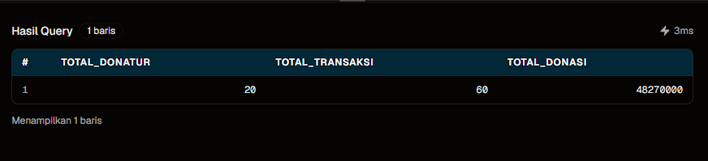
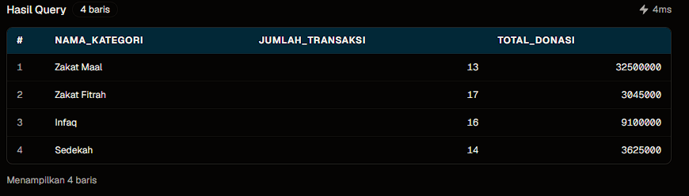
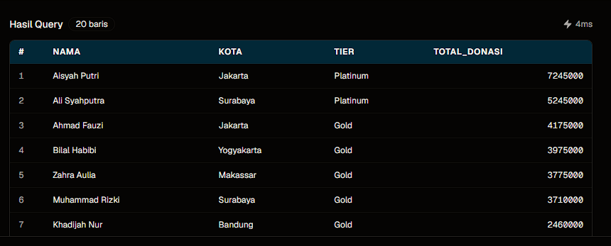
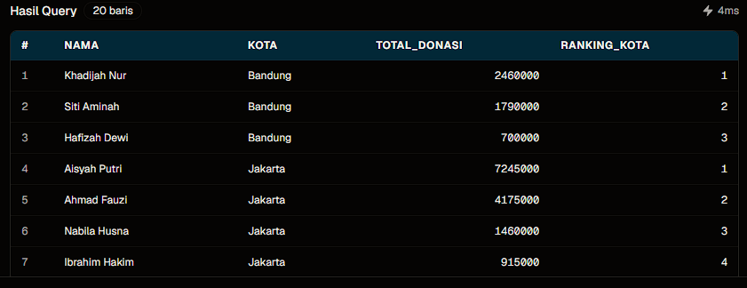
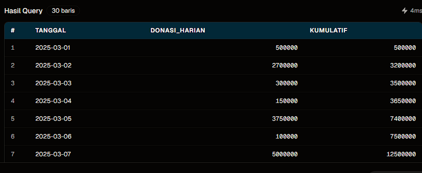
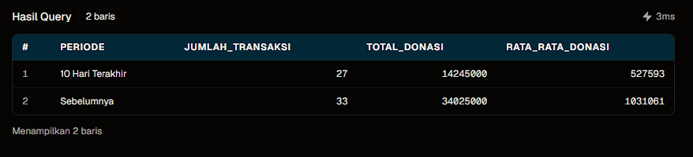
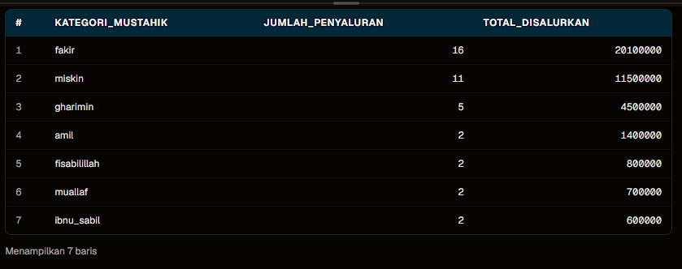
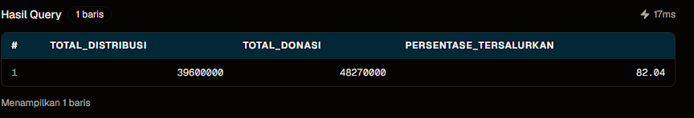
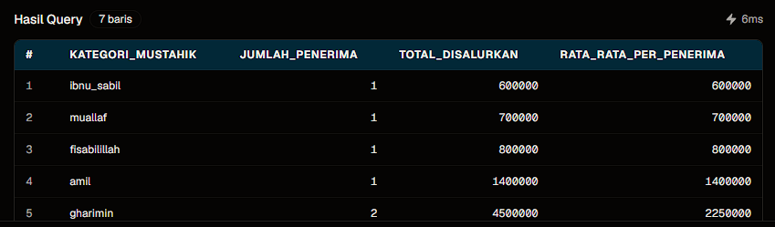
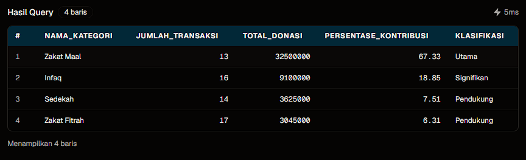

# Dari Data ke Aksi: Rekomendasi Strategis

## Ringkasan Proyek

Analisis ini mengubah data donasi Ramadan BerbagiRamadan menjadi insight yang dapat ditindaklanjuti. Fokus analisis mencakup performa donasi, perilaku donatur, efektivitas kanal pembayaran, serta pemerataan penyaluran kepada mustahik.

## Temuan Utama

| Temuan                                                        | Insight Bisnis                                                                           |
| ------------------------------------------------------------- | ---------------------------------------------------------------------------------------- |
| Total donasi **Rp48,27 juta** dari **20 donatur**             | Rata-rata kontribusi sekitar **Rp2,4 juta** per donatur                                  |
| Zakat Maal menyumbang **67,33%** total donasi                 | Portofolio dana masih sangat bergantung pada satu kategori                               |
| Terdapat **2 donatur Platinum**                               | Terlihat pola _Pareto effect_: sebagian kecil donatur menyumbang nominal besar           |
| Transaksi 10 hari terakhir mencapai **27 transaksi**          | Periode akhir Ramadan membutuhkan kapasitas operasional dan pembayaran yang lebih tinggi |
| Efisiensi penyaluran mencapai **82,04%**                      | Sekitar **18% dana** masih perlu segera dialokasikan                                     |
| Ibnu sabil, muallaf, dan fisabilillah menerima porsi terkecil | Perlu strategi khusus untuk memperbaiki pemerataan distribusi                            |

## Visualisasi Hasil Analisis

### 1. Gambaran Umum Donasi Ramadan

Total 20 donatur menghasilkan 60 transaksi dengan total donasi Rp48,27 juta.

### 2. Donasi Berdasarkan Kategori

Zakat Maal menjadi kontributor terbesar, disusul infaq, sedekah, dan zakat fitrah.

### 3. Segmentasi Donatur

Segmentasi berdasarkan total kontribusi membantu menentukan pendekatan komunikasi untuk setiap kelompok donatur.

### 4. Ranking Donatur per Kota

Data ini dapat digunakan untuk memberikan apresiasi dan membangun hubungan dengan donatur utama di setiap wilayah.

### 5. Tren Donasi Harian

Running total membantu tim melihat perkembangan donasi dari hari ke hari selama Ramadan.

### 6. Perbandingan 10 Hari Terakhir

Periode 10 hari terakhir mencatat 27 transaksi dengan total Rp14,25 juta. Angka ini menunjukkan perlunya kesiapan operasional pada periode puncak.

### 7. Distribusi Dana per Kategori Mustahik

Penyaluran masih terkonsentrasi pada kategori fakir dan miskin, sementara beberapa kategori lain masih menerima porsi yang terbatas.

### 8. Efisiensi Penyaluran Donasi

Sebanyak 82,04% dari total donasi telah disalurkan.

### 9. Rata-rata Penyaluran per Penerima

Insight ini membantu membandingkan besaran bantuan rata-rata antar kategori mustahik.

### 10. Komposisi Kontribusi Donasi

Zakat Maal berkontribusi 67,33% dan menjadi kategori utama. Diversifikasi infaq dan sedekah perlu ditingkatkan untuk mengurangi risiko ketergantungan.

## Rekomendasi untuk Ramadan Berikutnya

### 1. Meningkatkan Retensi dan Pertumbuhan Donatur

- Berikan pendekatan personal kepada donatur **Platinum** dan **Gold** melalui laporan dampak eksklusif, undangan kegiatan, dan program apresiasi.
- Dorong donatur **Silver** untuk naik ke kategori **Gold** dengan kampanye yang lebih relevan dan target peningkatan kontribusi sebesar **20%**.
- Edukasi donatur **Bronze** melalui konten _impact story_, nominal donasi fleksibel, dan proses pembayaran yang sederhana.

### 2. Menyiapkan Kampanye pada Periode Puncak

- Mulai kampanye intensif sejak hari ke-20 Ramadan karena frekuensi donasi meningkat pada 10 hari terakhir.
- Pastikan sistem pembayaran, terutama e-wallet dan QRIS, mampu menangani lonjakan transaksi.
- Kirim pengingat zakat fitrah sekitar hari ke-25 untuk memaksimalkan waktu donasi sebelum Ramadan berakhir.

### 3. Memperbaiki Pemerataan Distribusi

- Alokasikan dana khusus untuk kategori **ibnu sabil**, **muallaf**, dan **fisabilillah** yang masih _under-served_.
- Rekrut lebih banyak penerima manfaat dari kategori minoritas agar distribusi lebih merata.
- Tetapkan target minimum penyaluran untuk setiap kategori mustahik dan pantau pencapaiannya secara berkala.

### 4. Mengoptimalkan Kanal Pembayaran

- Pertahankan transfer bank sebagai kanal utama untuk donasi bernilai besar, khususnya zakat maal.
- Perluas integrasi e-wallet dan QRIS untuk donasi kecil seperti zakat fitrah dan sedekah.
- Kurangi ketergantungan pada pembayaran tunai karena lebih sulit dilacak dan direkonsiliasi.

### 5. Mendiversifikasi Sumber Dana

- Kurangi ketergantungan pada zakat maal yang saat ini menyumbang sekitar 67% total donasi.
- Tingkatkan kampanye infaq dan sedekah yang dapat dilakukan sepanjang tahun.
- Tetapkan target Ramadan berikutnya: kontribusi zakat maal di bawah **50%** dengan peningkatan porsi infaq dan sedekah.

## Prioritas Implementasi

| Prioritas | Aksi                                              | Indikator Keberhasilan                                    |
| --------- | ------------------------------------------------- | --------------------------------------------------------- |
| Tinggi    | Menyiapkan sistem pembayaran untuk periode puncak | Tidak ada transaksi gagal atau keterlambatan rekonsiliasi |
| Tinggi    | Membuat target minimum per kategori mustahik      | Porsi kategori under-served meningkat                     |
| Tinggi    | Menjalankan program retensi Platinum dan Gold     | Tingkat donatur kembali meningkat                         |
| Menengah  | Mengembangkan kampanye infaq dan sedekah          | Porsi dana non-zakat maal meningkat                       |
| Menengah  | Memperluas kanal e-wallet dan QRIS                | Jumlah transaksi digital meningkat                        |

## Kesimpulan

Program donasi telah mengumpulkan dana yang kuat, tetapi masih menghadapi dua tantangan utama: ketergantungan pada donatur dan kategori dana tertentu, serta ketidakmerataan penyaluran. Dengan memprioritaskan retensi donatur, kesiapan periode puncak, diversifikasi sumber dana, dan pemerataan mustahik, BerbagiRamadan dapat meningkatkan dampak sosial sekaligus menjaga pertumbuhan donasi secara berkelanjutan.
