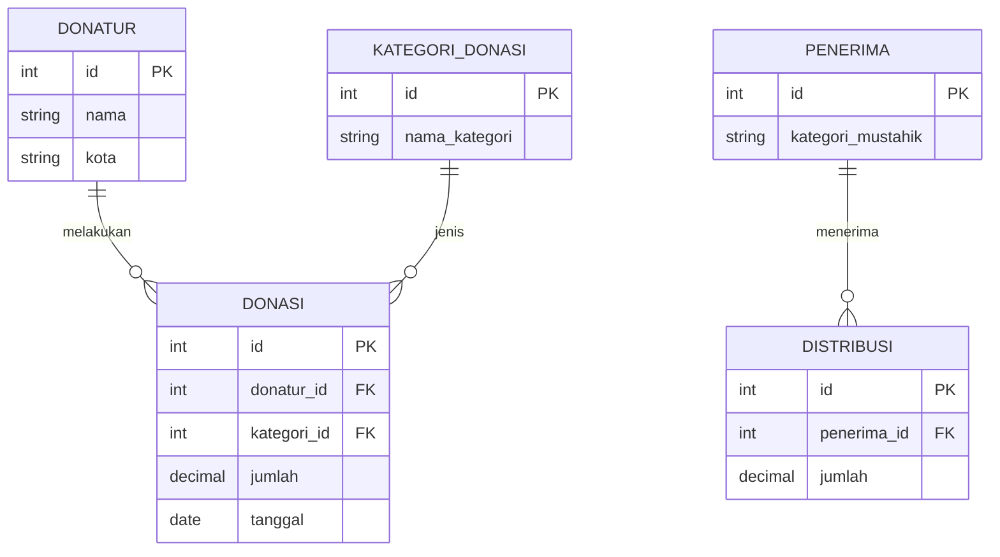

# Analisis Donasi Zakat Ramadan 1446H dengan SQL

Analisis data donasi dan penyaluran zakat lembaga **BerbagiRamadan** selama Ramadan 1446H (Maret 2025), menggunakan SQL untuk menjawab pertanyaan operasional dan strategis: dari mana donasi datang, siapa donatur utamanya, kapan donasi ramai, dan seberapa merata penyalurannya.

## Pertanyaan Bisnis

| #   | Pertanyaan                                                  | Teknik SQL                     |
| --- | ----------------------------------------------------------- | ------------------------------ |
| 1   | Berapa donatur, transaksi, dan total donasi yang terkumpul? | Agregasi                       |
| 2   | Kategori donasi mana yang paling besar kontribusinya?       | JOIN, GROUP BY                 |
| 3   | Bagaimana pembagian donatur ke dalam tier kontribusi?       | CTE, CASE                      |
| 4   | Siapa donatur paling dermawan di tiap kota?                 | Window function (`DENSE_RANK`) |
| 5   | Bagaimana tren donasi harian dan akumulasinya?              | Running total (`SUM() OVER`)   |
| 6   | Apakah donasi benar melonjak di 10 hari terakhir?           | CASE, normalisasi per hari     |
| 7   | Ke golongan mustahik mana dana disalurkan?                  | JOIN, GROUP BY                 |
| 8   | Berapa persen donasi yang sudah tersalurkan?                | CTE, CROSS JOIN                |
| 9   | Golongan mustahik mana yang menerima paling sedikit?        | LEFT JOIN, COALESCE            |
| 10  | Bagaimana ringkasan kontribusi per kategori untuk board?    | CTE berlapis, window function  |

## Dataset

- **Sumber:** Dataset Course Donasi Ramadhan
- **Periode:** Ramadan 1446H (1-30 Maret 2025)
- **Ukuran:** 20 donatur, 60 transaksi donasi, 7 golongan mustahik

### Skema tabel

Kolom di bawah hanya yang dipakai dalam query.

Tabel `distribusi` tidak terhubung ke `donasi`, sehingga dana yang disalurkan tidak bisa dilacak berasal dari donasi yang mana. Efisiensi penyaluran karena itu hanya bisa dihitung di level total.

## Temuan Utama

| Temuan                                                                                                                                              | Makna                                                                                                         |
| --------------------------------------------------------------------------------------------------------------------------------------------------- | ------------------------------------------------------------------------------------------------------------- |
| Total donasi **Rp48,27 juta** dari **20 donatur** dan **60 transaksi**                                                                              | Rata-rata Rp2,41 juta per donatur                                                                             |
| **Zakat Maal 67,33%** dari total donasi (hanya 13 transaksi)                                                                                        | Ketergantungan tinggi pada satu kategori yang berisi sedikit transaksi bernilai besar                         |
| **2 donatur Platinum** menyumbang Rp12,49 juta (**25,9%** total)                                                                                    | Donasi terkonsentrasi pada sedikit donatur                                                                    |
| 10 hari terakhir: transaksi per hari naik **±64%** (1,65 menjadi 2,7), tetapi rata-rata per transaksi turun dari **Rp1,03 juta menjadi Rp528 ribu** | Yang melonjak adalah **jumlah donasi kecil**, bukan nominal total (Rp1,70 juta/hari menjadi Rp1,42 juta/hari) |
| **82,04%** dana (Rp39,6 juta) sudah disalurkan                                                                                                      | Rp8,67 juta belum tersalurkan                                                                                 |
| **Fakir dan miskin menerima ±79,8%** dana yang disalurkan                                                                                           | Ibnu sabil, muallaf, dan fisabilillah masing-masing hanya Rp0,6-0,8 juta dan hanya 1 penerima                 |

## Hasil Analisis

### 1. Gambaran umum

20 donatur, 60 transaksi, total Rp48,27 juta.

### 2. Donasi per kategori

Zakat Maal terbesar, disusul Infaq, Sedekah, dan Zakat Fitrah.

### 3. Segmentasi donatur

Aisyah Putri (Jakarta) dan Ali Syahputra (Surabaya) adalah dua donatur Platinum.

### 4. Ranking donatur per kota

### 5. Tren donasi harian

### 6. 10 hari terakhir vs sebelumnya

| Periode          | Hari | Transaksi | Total        | Transaksi/hari | Donasi/hari | Rata-rata/transaksi |
| ---------------- | ---- | --------- | ------------ | -------------- | ----------- | ------------------- |
| Sebelumnya       | 20   | 33        | Rp34,03 juta | 1,65           | Rp1,70 juta | Rp1,03 juta         |
| 10 hari terakhir | 10   | 27        | Rp14,25 juta | 2,70           | Rp1,42 juta | Rp528 ribu          |

Total donasi 10 hari terakhir terlihat lebih kecil karena periodenya separuh, jadi perbandingan dibuat per hari. Hasilnya: donatur lebih sering berdonasi di akhir Ramadan, tetapi dengan nominal lebih kecil.

### 7. Distribusi dana per mustahik

Fakir (Rp20,1 juta) dan miskin (Rp11,5 juta) mendominasi, disusul gharimin Rp4,5 juta.

### 8. Efisiensi penyaluran

Rp39,6 juta dari Rp48,27 juta (82,04%) sudah tersalurkan.

### 9. Rata-rata penyaluran per penerima

Ibnu sabil, muallaf, dan fisabilillah masing-masing hanya punya 1 penerima, sehingga rata-ratanya sama dengan jumlah yang diterima satu orang. Angka ini menunjukkan alokasi kecil, bukan pola yang kuat secara statistik.

### 10. Laporan eksekutif per kategori

| Kategori     | Transaksi | Total        | Kontribusi | Klasifikasi |
| ------------ | --------- | ------------ | ---------- | ----------- |
| Zakat Maal   | 13        | Rp32.500.000 | 67,33%     | Utama       |
| Infaq        | 16        | Rp9.100.000  | 18,85%     | Signifikan  |
| Sedekah      | 14        | Rp3.625.000  | 7,51%      | Pendukung   |
| Zakat Fitrah | 17        | Rp3.045.000  | 6,31%      | Pendukung   |

## Rekomendasi

1. **Jaga hubungan dengan donatur utama.** Dua donatur Platinum menyumbang seperempat total donasi. Siapkan laporan dampak dan komunikasi personal. Untuk Silver dan Bronze, tetapkan target kenaikan setelah ada data tahun sebelumnya sebagai pembanding.
2. **Siapkan 10 hari terakhir untuk donasi kecil yang lebih sering.** Frekuensi naik sekitar 64% per hari. Pastikan proses verifikasi dan rekonsiliasi donasi mampu menangani volume lebih tinggi, dan sediakan pilihan nominal kecil.
3. **Tinjau Rp8,67 juta dana yang belum tersalurkan.** Cek apakah itu sengaja disimpan (misalnya cadangan) atau tertunda, lalu tetapkan jadwal penyaluran.
4. **Tetapkan alokasi yang disengaja untuk golongan dengan porsi kecil.** Penyaluran tidak harus sama rata, dan fakir-miskin memang bisa menjadi prioritas. Yang perlu dipastikan adalah bahwa porsi ibnu sabil, muallaf, dan fisabilillah merupakan keputusan, bukan kebetulan karena jumlah penerimanya hanya satu.
5. **Kurangi ketergantungan pada Zakat Maal (67,33%).** Kembangkan program Infaq dan Sedekah yang bisa berjalan sepanjang tahun, dengan target porsi yang ditentukan lembaga.
